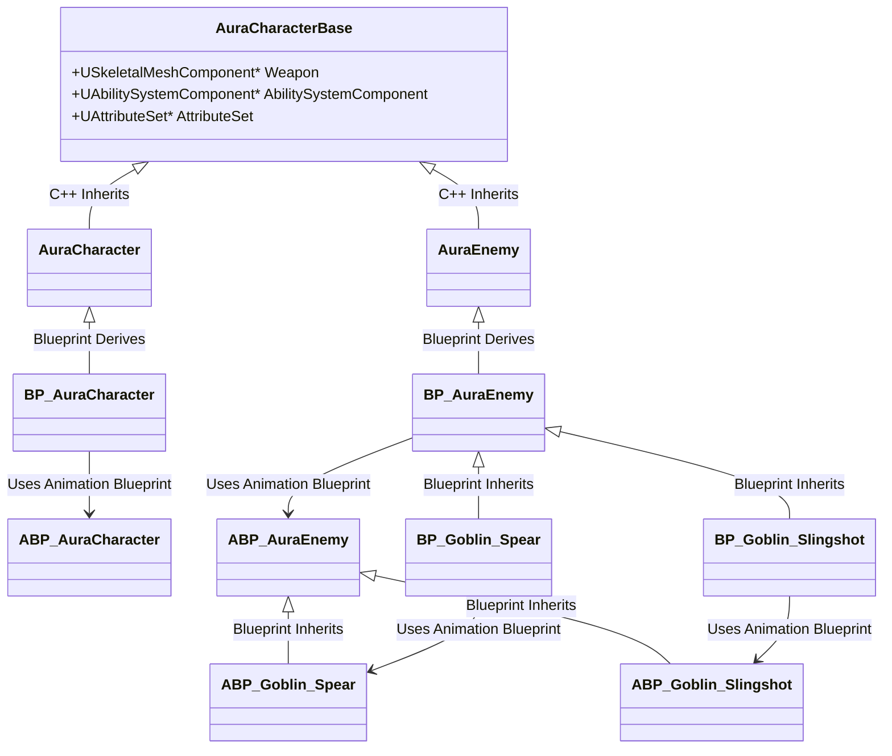
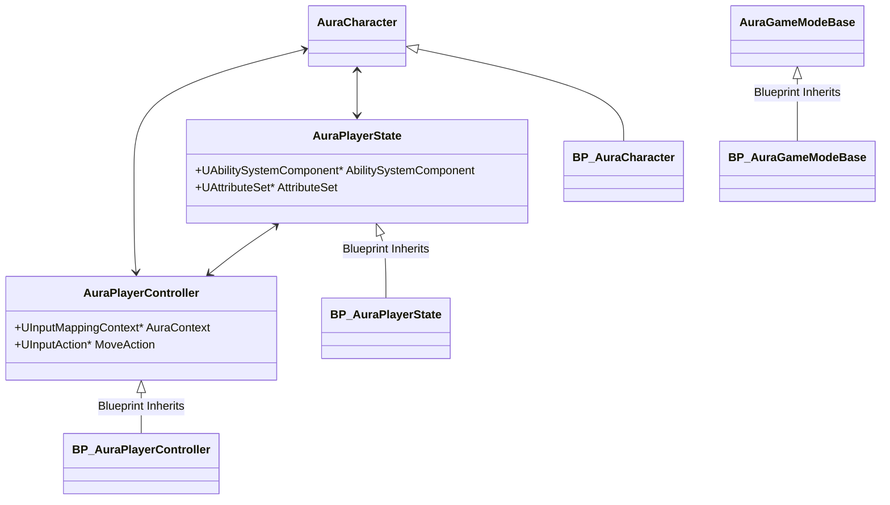

# UE5_GAS_Aura
A long journey of learning UE5. My Unreal Engine version is 5.3. This project follows the Udemy course: [Unreal Engine 5 - Gameplay Ability System - Top Down RPG](https://www.udemy.com/course/unreal-engine-5-gas-top-down-rpg/?couponCode=ST7MT290425G1).

## 1. Preparation

### 1.1 Create Character Classes

In this stage, we only have to create several Character classes and blueprints inherited from them in the editor. The classes are organized as follows:



As we can see, the core codes are written in C++ and the actors instantiated in the game are from the blueprints. The first lesson I've learnt is that we should choose carefully between C++ and a blueprint. Some strongly visually relevant components such as a spring arm connected with a camera in `AuraCharacter` don't have to be put in C++ codes. This won't cause much performance loss.

### 1.2 Create Game Framework and Bind Input

As I understand it, game framework in UE5 is often referred to as `GameMode`, `PlayerController`, `PlayerState`, `GameInstance`, etc., which is not the visible actor in the level but controls our game process.

`GameInstance` exists throughout the game, no matter what the map is. There exists only one `GameMode` to each level. And we can set `PlayerControllerClass`, `PlayerStateClass`, `DefaultPawnClass` in the `GameMode`. This framework is what UE5 provides for us to create an AAA game with a nice architecture. The classes in the project is organized as follows:



The Enhanced Input Subsystem is used to bind the input. In my former UE5 study, I always bound the input in my Character blueprint. However, in this tutorial, the input is bound in the Controller C++ class. The C++ setup is fairly new to me. So I have to write it down here. The `AAuraPlayerController::Move` is the delegate function which is defined by ourselves to handle the input values.

```c++
void AAuraPlayerController::SetupInputComponent()
{
	Super::SetupInputComponent();

	UEnhancedInputComponent* EnhancedInputComponent = CastChecked<UEnhancedInputComponent>(InputComponent);
	EnhancedInputComponent->BindAction(MoveAction, ETriggerEvent::Triggered, this, &AAuraPlayerController::Move);
}
```

Once again `AbilitySystemComponent` and `AttributeSet` appear in our `AuraPlayerState` (they appeared in `AuraCharacterBase` once). Gameplay Ability System (GAS) is the most important thing I will learn about in this course. I can't wait to dive into this wonderful mechanism!

## 2. Gameplay Ability System (GAS)

